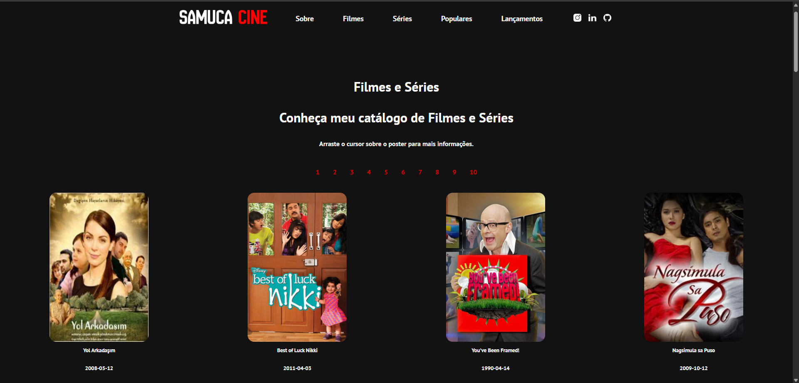

# **Samuca Cine - Catálogo de Filmes**  
Um catálogo de filmes completo e intuitivo para os amantes de cinema!  

---

<table>
  <tr>
    <td align="left">
      <a href="https://catalogo-filmes-tkxg.onrender.com/">
        <br>
        <sub>
        <b>Cotação de Criptomoedas!</b>
        </sub>
      </a>
    </td>
  </tr>
</table>

---
## **Índice**  
- [Pré-requisitos](#pré-requisitos)  
- [Instalação](#instalação)  
- [Execução](#execução)  
- [Testes](#testes)  
- [Tecnologias Utilizadas](#tecnologias-utilizadas)  
- [Versão](#versão)  
- [Autor](#autor)  

---

## **📋 Pré-requisitos**  
Antes de começar, verifique se você possui o seguinte:  
- **Node.js e npm:** Instale as versões mais recentes em [nodejs.org](https://nodejs.org/).  
- **Editor de código:** Visual Studio Code, Sublime Text, ou outro de sua preferência.  
- **Conta no TMDb:** Crie uma conta para obter sua chave API em [The Movie Database](https://www.themoviedb.org/).  
- **Git:** Para clonar o repositório do projeto.  

---

## **🔧 Instalação**  
Siga os passos abaixo para configurar o projeto localmente:  

1. **Clone o repositório:**  
   ```bash  
   git clone https://github.com/devsamuca/catalogo-filmes.git  
   ```  

2. **Acesse o diretório do projeto:**  
   ```bash  
   cd catalogo-filmes  
   ```  
3. **Renomeie o arquivo .env.example para .env**
    ```bash
    mv .env.example .env
    ```
  

4. **Abra o arquivo .env e adicione sua chave do tmdb**

  
5. **Instale as dependências:**  
   ```bash  
   npm i 
   ```

6. **Instale o nodemon:**  
   ```bash  
   npm i nodemon  
   ```  

7. **Inicie o servidor:**  
   ```bash  
   npm run dev  
   ```  

---

## **⚙️ Execução**  
Após a instalação, você poderá acessar o sistema no navegador em:  
`http://localhost:3333`  

---

## **🧪 Testes**  
Verifique o funcionamento do sistema realizando os seguintes testes:  
- **Funcionalidade dos botões:** Certifique-se de que estão funcionando corretamente.  
- **Redirecionamento de páginas:** Verifique se os links levam aos destinos corretos.  
- **Responsividade:** Teste a exibição da página em diferentes tamanhos de tela.  

*Dica:* Explore possíveis erros ou melhorias na aplicação.  

---

## **🛠️ Tecnologias e Ferramentas Utilizadas**  
Este projeto foi desenvolvido utilizando as seguintes tecnologias e ferramentas:  


---

## **📌 Versão**  
Consulte as [tags neste repositório](https://github.com/devsamuca/catalogo-filmes/tags) para visualizar as versões do projeto.  

---

## **✒️ Autor**  
Desenvolvido por **Samuel Souza** 🌹  
- [GitHub](https://github.com/devsamuca)  
- [LinkedIn](https://www.linkedin.com/in/devsamuel/)  

---
